## Debugging With the FHIRPath Lab
The FHIRPath Lab is the best tool for debugging FHIRPath expressions. It has many features that help in diagnosing issues...

So lets have a quick walkthrough of the key features in the lab.

Basic UI Components:
1. Test Toolbar
2. Test Expression (with optional context)
3. Test Results
4. Test Resource (with optional Resource Id)<br/>
   Trace Data _(tab)_ (viewing results of the `trace()` function)
5. Debug Controls
6. AST (Abstract Syntax Tree)

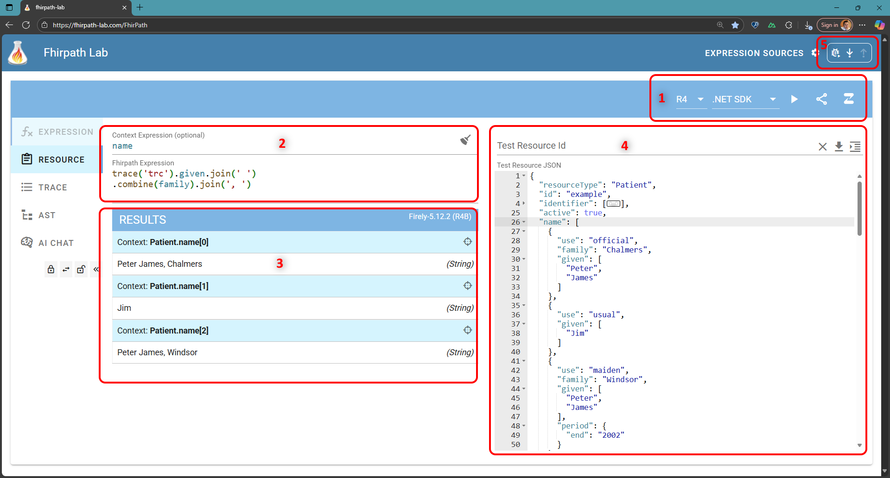

### 1. Test Toolbar
* FHIR Version Selector (R4, R5, R6-ballot3)<br/>
_(note that some of the engines are using R4B inplace of R4)_
* Engine Selector<br/>
_(note that some of the engines are hosted externally, and are specifically marked)_
* Evaluate Expression (play button)<br/>_Shortcuts available: `Ctrl`+`Enter` or `Alt`+`g`_
* Share link _(direct tester web address - to paste direct into browser  address)_
* Share link for fhir chat _(markdown format)_<br/>
_(this creates a link that displays well in the chat, with the test link)_

When you use the Share for fhir chat, the message looks something like this, and has the direct link so that others can test your expression too, complete with the expression and test resource!
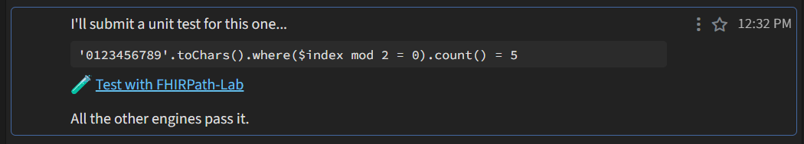
_(So a great reminder to never use real patient data in test resources - and particularly with external engines)_

### 2. Test Expression (with optional context)
The test expression is split into 2 fields, one for the expression that you want to test, and another to specify the context that the expression should be evaluated.

The `context` is used most often when verifying invariant expressions that don't apply at the base of the resource, but apply to a specific field.

The `context` can also be used to select a specific resource in a bundle, or other scenarios like that.

The "sweep" icon can be used to reset both the `context` and `expression` at once. 

The FHIRPath editor control has syntax highlighting, and function auto-completion with links to the specifications.
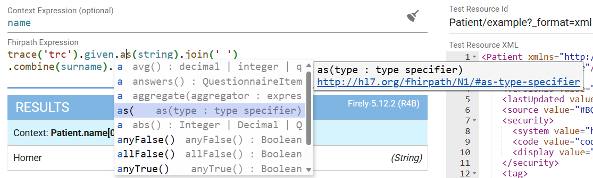

### 3. Test Results
The test results section contains several sub-components:

| Component | Description | Cardinality |
| --------- | ----------- | ----------- |
| Engine/Version | The FHIRPath engine name, version and fhir version that was used to produce the results.<br/> _This is very helpful when switching between engines and not recalling what version you last used._ | 1..1 |
| Context Sub-Header | _(light blue background)_ The path to the value in the test resource. This could be the result of the evaluation, or just the expression with an indexer on the end if the engine isn't able to indicate where it came from.<br/>e.g. `Patient.name[1]` or `Patient.name.where(use='official')[0]`<br/>_If the latter format is returned, the context navigator will not be available_ | 0..* |
| Context Navigator | Crosshairs icon that, when clicked, will temporarily highlight the context in the test resource. | 0..1 |
| Result Value | The actual result of the test expression _(complex datatypes will display the json equivalent)_ | 0..* |
| Result Datatype | The datatype of the result value<br/>e.g. `(String)`, `(HumanName)`<br/>_Some datatype names are not consistent across engines/fhir versions, specifically for backbone elements e.g. `(Patient#Contact)`_<br/>If the result was a string, and is empty, the datatype will be `(empty-string)` as a way to indicate that there was a value, but it's an empty string. | 1..1 |
| Result Path | If the result is from an element in the test resource (and the engine supports it), and wasn't mutated.<br/>e.g. `Patient.name[0].given[1]` | 0..1 |
| Result Navigator | Crosshairs icon that, when clicked, will temporarily highlight the value in the test resource. | 0..1 |

#### Example Result with no context
_note that there are no context heading(s)_
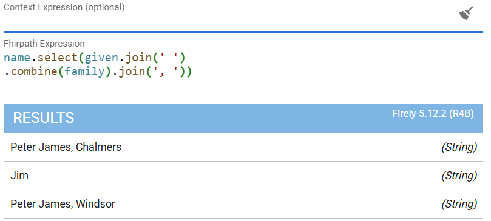

#### Example Result with context
This sample also shows the navigator controls
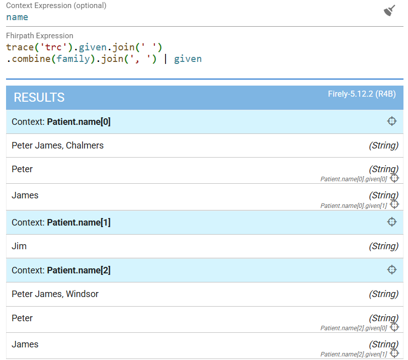

#### Navigation 
When the Crosshairs icon is clicked, this temporary highlight is shown in the test resource.

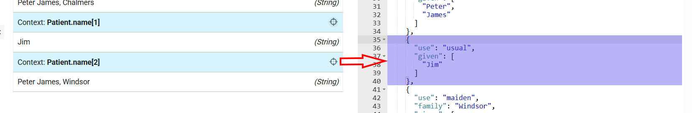

#### Example Result with errors/warnings
Some expressions could return errors/warnings along with results, and when they do, they will look something like this:
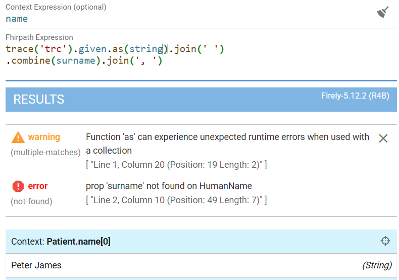

In this case the `surname` doesn't exist on the datatype `HumanName` (as the expression is evaluated on the name context already), and also a warning indicating that you're trying to use the `as()` function on a possible collection, where the function doesn't support collections according to the standard. The `surname` should really be `family` in the FHIR object model, and the `as()` should just be removed.

### 4. Test Resource (with optional Resource Id)
The Test Resource contains the resource that will be used to test the FHIRPath expression on. It is more than just a text field that you paste your content in. It supports:

**Content Management:**
* `json` and `xml` formatted resource<br/>_(xml has limited engine support)_
* Copy and paste test resources direct into the Test Resource field
* Re-format test resource (json)
* Download test resource<br/>_(press `enter` key in resource id field to download)_
* Search, and replace for text

**Navigation & Display:**
* Line numbering
* collapsible text sections (properties)
* Property navigation/highlight from results<br/>(context, value, trace, and debug)

#### Downloading Test Resources
The Test Resource Id field can load resources from:
* a FHIR Server (relative via default base URL in settings, or absolute URLs)
* a HL7 Github repository
* the HL7 website
* the HL7 CI server (any sub-directory of https://build.fhir.org)
* any other website supporting CORS from https://fhirpath-lab.com

As the field is evaluated as a web request, you can provide any other parameters to the request, such as the standard FHIR format parameter `?_format=xml` to explicitly request XML from a server.
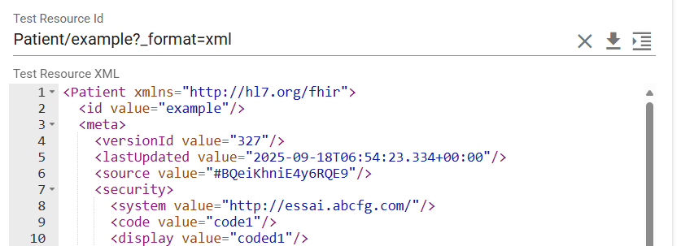
The web request includes this accept header:
`application/fhir+json, application/json, application/fhir+xml, text/xml` which relies on content negotiation on the server to decide which format to return. Hence the usual return is json, but if the server only supported XML, then it could return that too. _(and the fhir _format parameter will over-ride this if provided)_

The FHIRPath Lab User Settings (gear icon in top right) contains the base URL for retrieving examples if only providing a relative resource reference.
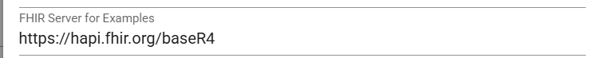
_(defaulting to the public HAPI server)_

**Some other download resource ID examples:**

Search for the first 3 patients on the public HAPI test server
```
https://hapi.fhir.org/baseR4/Patient?_count=3
```

Search for at most 30 observations with a specific code
on the default examples server (in user settings)
```
Observation?_count=30&code=94558-4&_summary=data
```

Download an xml test resource from the core spec - failing invariant
```
https://github.com/HL7/fhir/blob/master/source/imagingstudy/invariant-tests/ist-7.f2.fail.xml
```

Download an xml test resource from a branch of an IG on the CI build _(pasted direct from the URL on the page)_
```
https://build.fhir.org/ig/HL7/davinci-deqm/branches/__default/MeasureReport-attestation-boolean-example.xml.html
```
> note that the lab knows these URLs and removes the .html from the end.

Load a specific version of a resource from a FHIR server
```
Patient/example/_history/4
```

### Trace Data
Before we get to the debug controls and debugging, let's look at the usual first step: using targeted `trace` statements to inspect specific points in the expression evaluation.
 _(and not all engines support the debugger too...)_

This is the simplest first step, as the `trace` function enables you to inspect the value of specific nodes in the expression without impacting the overall processing.

The [`trace`](https://build.fhir.org/ig/HL7/FHIRPath/#tracename--string--projection-expression--collection) function takes a name parameter, and an optional expression to evaluate.
The `name` parameter is used as a label so that if there are multiple traces (common) then you can tell which trace results are for which traced expression node(s).
If the optional expression isn't provided, then the input collection will be traced. The result of the trace() function is the input collection, hence it should have no impact on the rest of the evaluation.
The trace data read during expression evaluation is presented on the `TRACE` tab as shown here:

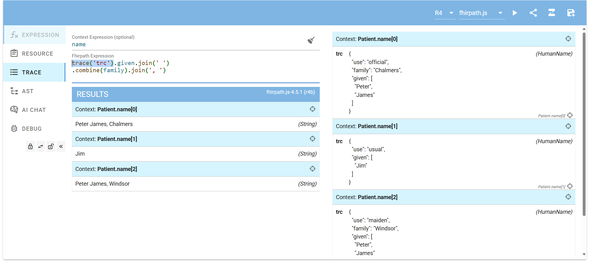

This example shows the trace output for each context when using `trace('trc')` in the expression. The trace name `trc` appears in the output to identify this specific trace point.

As with the test results, the trace results are collected under context evaluation sub-headers, and also have the context highlight crosshairs.
They also include the path, and datatype where available.

#### Example: Debugging with trace()
Consider this expression
``` fhirpath
Patient.name.where(use='official').given
```
If this expression wasn't returning the expected data, we could inject some traces to see if the filtering is causing the issue:
``` fhirpath
Patient.name.trace('all-names').where(use='official').trace('filtered-names').given
```
Then visually check the resulting trace data.

### 5. Debug Controls
> **Note:** The debug controls are currently only available for the .NET and java engines, and debug is available after the expression is evaluated _(it's actually a tracer, or post-mortem debugger, not live debugging)_. Support for fhirpath.js is coming soon...

The debug buttons _(found in the toolbar at the top of the page in the header)_ permit stepping through the evaluation of an expression.


- debug/play ▶️ - Starts/restarts debugging, stepping to the first node in the expression
- down arrow ⬇️ - Advances to the next node in the expression evaluation
- up arrow ⬆️ - Returns to the previous node in the expression evaluation

> _**Note:** Currently there is no way to skip, or jump to specific nodes._

The other parts of the debugger are shown just above the regular results area, labeled `Debug Variables`.

This is where the current state of the debugger is shown, along with a highlight on the current node in the expression.

This example shows the debugger with the current step on the `given` node in the expression:

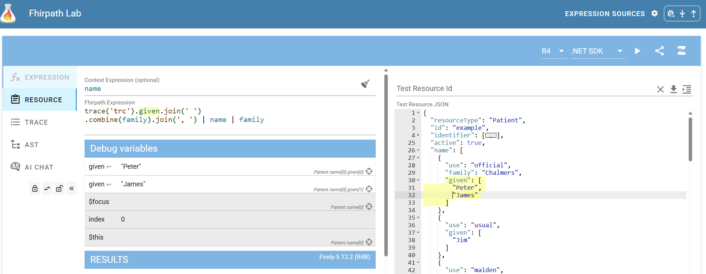

At this point the UI shows:
| Section/Control | Example Value | Description |
| --------------- | ------------- | ----------- |
| Expression | `given` node highlighted | The current step in the debugger, here the `given` property accessor is the current expression node being evaluated |
| Debug Variables | given <--  | (white background) The result(s) of the evaluation of the current expression node<br/>The `<--` indicates that this line is the result of the node _(node name is to its left)_ |
| Debug Variables | _$focus_ | The input collection to the current expression node (given)<br/>_Note that the $focus is not a real fhirpath variable, it's a FHIRPath Lab alias for the input collection_ |
| Debug Variables | `$index` | The current index of the evaluation context _($this)_ |
| Debug Variables | `$this` | The current evaluation context |
| Test Resource | Highlighted property(s) | The highlighted (in yellow) properties are the result of the current node's evaluation |

Each of the debug variables may include crosshairs to help briefly highlight the value in the test resource (in purple).

If debug variables refer to properties in the test resource, they will include the path to that next to the crosshairs (as shown in the example).
If the value is a primitive its value is also shown in the variables table, if it is complex, then only the path to the property is shown.


### 6. AST (Abstract Syntax Tree)

The final section in our FHIRPath tester is the AST. This is one of the more advanced sections in the tester, but is super useful once you understand what it does.

The Abstract Syntax Tree is a representation of your expression, broken down into all its sub-expressions, each of which I've referred to as a _node_ previously.
This view makes it easy to expand and collapse complex parts of expressions, and with the crosshairs here, you can easily navigate to a specific node in your expression.

The AST view is similar to:
* Browser developer tools showing the DOM tree
* Debuggers showing call stacks
* IDEs showing code structure/outline views

Not all engines support the AST view, and not all engines provide positioning information to use for the crosshair navigation.

> **Note:** When using the .NET or java engines, type and cardinality information is also available, which lets you know what possible datatypes the sub-expression (node) could possibly be.
> This is statically checked, and not what was actually evaluated for your specific test resource. This means that you can tell if the calculated result was of the type you're expecting, or if there are other types you didn't expect, and need to change the expression to handle properly. Such as using `ofType(string)` to filter to a specific type, or using `select(...)` to handle each value in a collection individually.

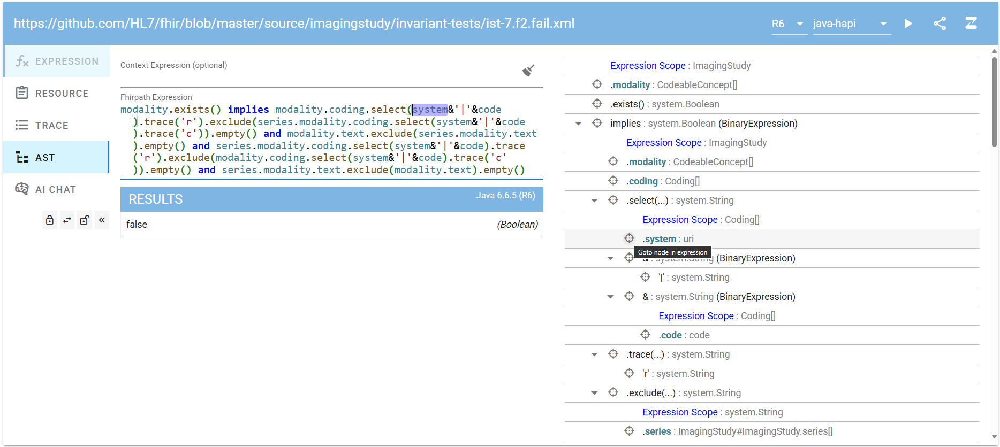

As the AST is a representation of the expression, and not the evaluation, the context expression is not represented in the AST, however the processing of the expression uses the datatype of the result of the context to be the datatype to apply as input to the processing. Without a context expression, the datatype used to process the AST is the type of the test resource, in the examples we've use here that is `Patient`.


#### The Inverted Tree
There are 2 modes to view the AST in:
| Default View | Inverted View |
| ------------ | ------------- |
| A common way engines internally represent their AST | A more human left to right, top down approach |
|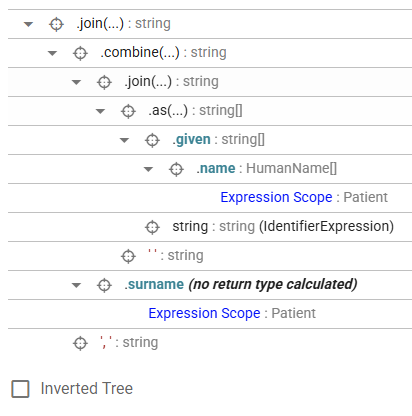|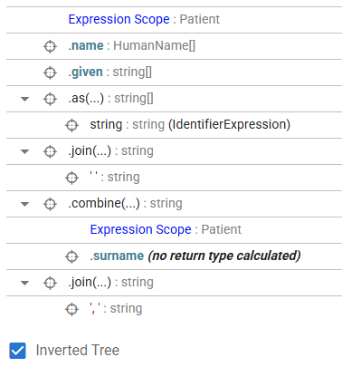|

The inverted tree is algorithmically generated from the default AST.

These 2 views show the `Expression Scope` node in the tree. This is a special node that indicates the evaluation context of a node.
We find these at the root of the expression, or anywhere a new scope/context is being processed.
This is one of key features that can quickly identify problems in complex deeply nested expressions.

#### Common uses of the AST
There are many reasons that I reach for the AST, these are some of them:
* Check datatypes and cardinality of all nodes
* Check datatypes of expression scopes
* Check datatypes going into operations (commonly non boolean values going into boolean functions)
* Check that brackets () are matching correctly
* Checking properties actually exist
* Navigating large expressions

#### Example: Debugging with the AST
Consider this expression, how can we use the AST to locate the issues...
```fhirpath
name.given.as(string).join(' ').combine(surname).join(', ')
```
:test_tube: [Test with FHIRPath Lab](https://fhirpath-lab.com/FhirPath?parameters=N4IgpgHgDgTmDO8CWB7AdiAXCNBDAtmAHQDmSAbmGkbvABTwAuMSaJAlEQFYqt0DkAAn6cAxinwAjVmAYBXGHkKceffgBph7EOpBx4KBaLBYQABVyMkVRgHpIBKABswtgPoALJExQwAnrYALDrgbDKmRAByAKIAKoJ0AGZIcE5+2rqMYDD4rChOKCR+AMrZlDCmHoyMUPCYtrbwAI4FaIleMAC0MIE0AF4KYADuYJLIWfBEaGB27Skh5LgsuJIu8FgA2gC6AL5AA)

This expression attempts to combine given names with a surname, but has several issues:
1. `as(string)` is applied to a collection (should use each given name individually)
2. `surname` property doesn't exist on Patient (should be `family` from the name)
3. The end result is a single string, not a string for each name

Let's see how the AST helps identify these problems:

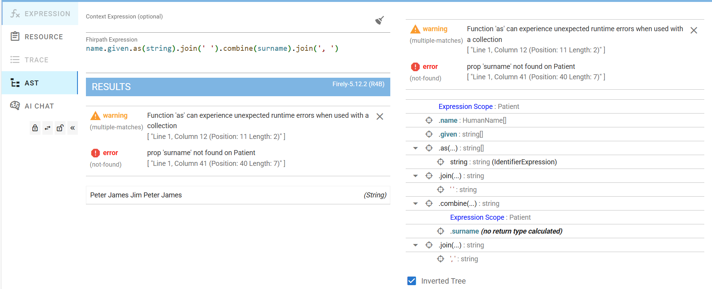

_(follow along with the lab live to see the intermediate steps and see if you find them too as you go...)_

Use the collection friendly form of type filtering _(navigate using the crosshairs on `as` to quickly select the node in the expression)_
``` fhirpath
name.given.ofType(string).join(' ').combine(surname).join(', ')
```

correct the property name: `surname` should be `family` _(navigate with crosshairs again)_
``` fhirpath
name.given.ofType(string).join(' ').combine(family).join(', ')
```
That was good, however we still get an error 'prop family not found on Patient'.
The Expression Scope in the combine tells us that the context at that point is a Patient, so we need to set the context for each name, so add in a select around the combine to set the context for each name in the patient _(need to process each name individually)_
``` fhirpath
name.select(given.ofType(string).join(' ').combine(family)).join(', ')
```

Whoops, the scope of the select also needs to have the join inside.<br/>
Was also able to see that using the AST where the resulting datatype is a single string, however we are expecting a list of strings, one for each name.

Can use the navigator on the last `join` function to select the right node, then move the bracket before it to after it, fixing the expression.
``` fhirpath
name.select(given.ofType(string).join(' ').combine(family).join(', '))
```
:test_tube: [Test with FHIRPath Lab](https://fhirpath-lab.com/FhirPath?parameters=N4IgpgHgDgTmDO8CWB7AdiAXCNBDAtmAHTxgA2YAxgC4AUA5kgG5hpEoBmAKgJ5Ri141GEjT0AlEQBWKUbQDkAAnmTKKfACNRAjgSRkekmXPkAaZePEhTIOPBQBXGJTBYQABVzUkragHpIAigKPwB9AAskIRQYHj8AFmtwMW03IgA5AFEuRVoOJDgDKxtqMBh8URQyFHoeAGUylhg3cOpqKHhMPz94AEdqtA5ImABaGHiiXAAvJzAAdzANZFL4IjQwfyGCpKZcEVwNCngsAG0AXQBfIA)

And now we can see no more errors, each of the issues was resolved, and the results are as we expect. The Expression Scope for the `combine` is the HumanName, which is what we expected too.

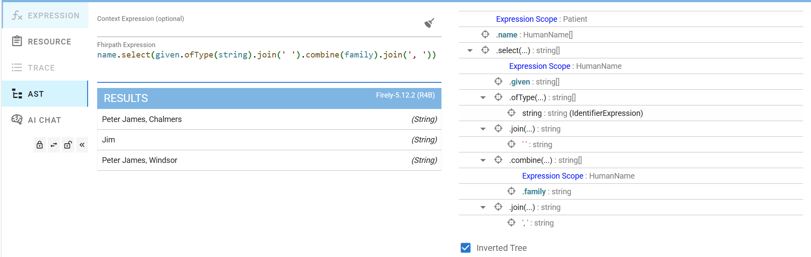

---

## Putting It All Together

The FHIRPath Lab provides a comprehensive debugging toolkit:
- **Quick feedback:** Test Results show immediate outcomes
- **Targeted inspection:** trace() for specific checkpoints
- **Deep analysis:** Debugger for step-by-step execution
- **Type verification:** AST for static analysis

Start simple (test results), add traces when needed, use the debugger for complex issues, and leverage the AST for type checking and understanding expression structure.
